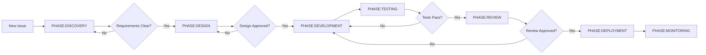

# Jira Issue Categorization Decision Guide

## 🎯 Quick Decision Tree

```
Start Here
    ↓
Is it a strategic business initiative with multiple features?
    YES → INITIATIVE Epic (6-12 months)
    NO ↓
    
Is it a complete business capability that users can see/use?
    YES → FEATURE Epic (3-6 months)
    NO ↓
    
Is it a major functional area within a feature?
    YES → CAPABILITY Epic (1-3 months)
    NO ↓
    
Is it a reusable technical module?
    YES → COMPONENT Epic (2-4 weeks)
    NO ↓
    
Is it a user-facing functionality?
    YES → Story (3-5 days)
    NO ↓
    
Is it a specific technical implementation?
    YES → Task (1-2 days)
    NO ↓
    
Is it a small piece of a larger task?
    YES → Sub-task (<1 day)
```

## 📊 Categorization Examples

### **INITIATIVE Level Examples**
**What goes here:** Strategic business initiatives that contain multiple features

✅ **Good Examples:**
- "INITIATIVE: AI-Powered Project Management Platform" - Complete platform vision
- "INITIATIVE: Enterprise Cloud Migration" - Multi-feature transformation
- "INITIATIVE: Mobile-First Customer Experience" - Strategic mobile initiative
- "INITIATIVE: Digital Marketplace Ecosystem" - Multi-sided platform
- "INITIATIVE: Data Intelligence Suite" - Multiple analytics features

❌ **Bad Examples (Too Small):**
- "User Authentication" - This is a Feature
- "Payment Gateway" - This is a Feature
- "Dashboard" - This is a Feature or Epic
- "API Development" - This is too vague

**Labels to Apply:**
```
INITIATIVE, SCOPE:XXL, PRIORITY:CRITICAL, DOMAIN:*, TEAM:*
```

### **FEATURE Level Examples**
**What goes here:** Complete business capabilities that deliver significant value

✅ **Good Examples:**
- "User Authentication System" - Complete login/logout/registration
- "Payment Processing" - Full payment flow with multiple providers
- "Real-time Collaboration" - Complete collaborative editing system
- "Analytics Dashboard" - Full analytics with multiple metrics
- "Mobile Application" - Complete mobile app

❌ **Bad Examples (Too Small):**
- "Login Form" - This is a Story
- "Add PayPal" - This is a Story or Epic
- "Fix Dashboard Bug" - This is a Task
- "Update UI Colors" - This is a Task

**Labels to Apply:**
```
FEATURE, SCOPE:XL, PRIORITY:HIGH, DOMAIN:*, TEAM:*
```

### **CAPABILITY Level Examples**
**What goes here:** Major functional areas that can be delivered independently

✅ **Good Examples:**
- "OAuth Integration" - Part of Authentication Feature
- "Stripe Payment Gateway" - Part of Payment Feature
- "Real-time Sync Engine" - Part of Collaboration Feature
- "Report Generation" - Part of Analytics Feature
- "Push Notifications" - Part of Mobile Feature

❌ **Bad Examples:**
- "Google OAuth Button" - This is a Story
- "Sync Algorithm" - This is a Task
- "PDF Export" - This is a Story

**Labels to Apply:**
```
CAPABILITY, SCOPE:L, PRIORITY:MEDIUM, DOMAIN:*, TEAM:*
```

### **Story Level Examples**
**What goes here:** User-facing functionality with clear acceptance criteria

✅ **Good Examples:**
- "As a user, I can reset my password via email"
- "As an admin, I can view user activity logs"
- "As a customer, I can filter products by price"
- "As a developer, I can access API documentation"

❌ **Bad Examples:**
- "Database optimization" - This is a Task
- "User Management System" - This is a Feature/Epic
- "Fix typo" - This is a Task/Sub-task

**Labels to Apply:**
```
SCOPE:M, TYPE:IMPLEMENTATION, DOMAIN:*, TEAM:*, PHASE:*
```

### **Task Level Examples**
**What goes here:** Specific technical work items

✅ **Good Examples:**
- "Create user table schema"
- "Write unit tests for auth service"
- "Configure CI/CD pipeline"
- "Optimize database queries"
- "Update API documentation"

❌ **Bad Examples:**
- "Build entire API" - This is an Epic
- "User can login" - This is a Story
- "Fix all bugs" - Too vague

**Labels to Apply:**
```
SCOPE:S, TYPE:*, TEAM:*, PHASE:*, NEEDS:*
```

## 🔍 Domain Assignment Guide

### **When to use DOMAIN:UI**
- Visual components
- Layout changes
- CSS/styling work
- Component libraries
- Responsive design

### **When to use DOMAIN:API**
- REST endpoints
- GraphQL schemas
- API documentation
- Rate limiting
- API versioning

### **When to use DOMAIN:DB**
- Schema changes
- Migrations
- Query optimization
- Indexing
- Data modeling

### **When to use DOMAIN:AUTH**
- Login/logout
- Permissions
- Role management
- Token handling
- Security policies

### **When to use DOMAIN:AI**
- Machine learning models
- AI agents
- Natural language processing
- Prediction algorithms
- Data training

## 📏 Scope Estimation Guide

### **SCOPE:XXL (>3 months)**
- Strategic initiative scope
- Multiple features involved
- Cross-organizational impact
- Major architectural decisions
- Requires executive alignment
- Multiple release cycles

### **SCOPE:XL (>3 weeks)**
- Feature or large epic scope
- Multiple epics/stories involved
- Cross-team coordination required
- Significant architecture changes
- Multiple integration points
- Requires phased delivery

### **SCOPE:L (1-3 weeks)**
- Single epic scope
- Team can deliver independently
- Well-defined boundaries
- Some integration work
- Clear acceptance criteria

### **SCOPE:M (3-5 days)**
- Single story scope
- One developer can complete
- Minimal dependencies
- Standard implementation
- Straightforward testing

### **SCOPE:S (1-2 days)**
- Single task scope
- Clear implementation path
- No external dependencies
- Quick to test
- Well-understood work

### **SCOPE:XS (<1 day)**
- Sub-task scope
- Very specific change
- No dependencies
- Minimal testing
- Often configuration/fixes

## 🚦 Priority Decision Matrix

| Impact ↓ / Urgency → | High Urgency | Medium Urgency | Low Urgency |
|----------------------|--------------|----------------|-------------|
| **High Impact**      | CRITICAL     | HIGH           | MEDIUM      |
| **Medium Impact**    | HIGH         | MEDIUM         | LOW         |
| **Low Impact**       | MEDIUM       | LOW            | BACKLOG     |

### **Impact Factors:**
- Number of users affected
- Revenue impact
- Security implications
- Blocker for other work
- Strategic importance

### **Urgency Factors:**
- Deadline proximity
- Customer commitments
- Regulatory requirements
- Market opportunity
- Competitive pressure

## 🔄 Phase Assignment Logic



## 🏷️ Label Combination Templates

### **New Initiative Template**
```
INITIATIVE
SCOPE:XXL
PRIORITY:CRITICAL
DOMAIN:UI + DOMAIN:API + DOMAIN:DB + DOMAIN:AI
TEAM:FULLSTACK + TEAM:DATA
PHASE:DISCOVERY
MILESTONE
```

### **New Feature Template**
```
FEATURE
SCOPE:XL
PRIORITY:HIGH
DOMAIN:UI + DOMAIN:API + DOMAIN:DB
TEAM:FULLSTACK
PHASE:DISCOVERY
MILESTONE
```

### **Bug Fix Template**
```
SCOPE:S
TYPE:BUGFIX
PRIORITY:HIGH
DOMAIN:[affected area]
TEAM:[responsible team]
PHASE:DEVELOPMENT
RISK:MEDIUM
```

### **Technical Debt Template**
```
COMPONENT
SCOPE:L
TYPE:REFACTOR
PRIORITY:LOW
DOMAIN:[technical area]
TEAM:BACKEND
PHASE:DISCOVERY
RISK:HIGH
```

### **Research Spike Template**
```
SCOPE:M
TYPE:RESEARCH
PRIORITY:MEDIUM
DOMAIN:[area to research]
TEAM:[investigating team]
PHASE:DISCOVERY
STANDALONE
```

## ✅ Validation Checklist

Before creating an issue, ensure:

- [ ] **Clear scope** - Can you explain it in one sentence?
- [ ] **Right level** - Feature vs Epic vs Story vs Task?
- [ ] **Proper labels** - At least: Scope, Domain, Type, Priority
- [ ] **Clear ownership** - Team label assigned?
- [ ] **Dependencies identified** - Blocks or blocked by?
- [ ] **Acceptance criteria** - How will we know it's done?
- [ ] **Estimated effort** - Scope label matches estimate?
- [ ] **Business value** - Why are we doing this?

## 🎯 Common Mistakes to Avoid

1. **Too Big:** Creating stories that are actually epics
2. **Too Vague:** "Improve performance" without specifics
3. **Missing Context:** No description or acceptance criteria
4. **Wrong Type:** Technical tasks marked as stories
5. **No Labels:** Missing critical categorization
6. **Duplicate Work:** Not checking for existing issues
7. **Poor Titles:** Unclear or non-descriptive summaries
8. **Missing Dependencies:** Not linking related issues
9. **Wrong Priority:** Everything marked as critical
10. **No Team Assignment:** Unclear ownership

---

Remember: Good categorization makes project management easier, enables better reporting, and helps teams work more efficiently. When in doubt, start with a larger scope and break it down as you learn more.